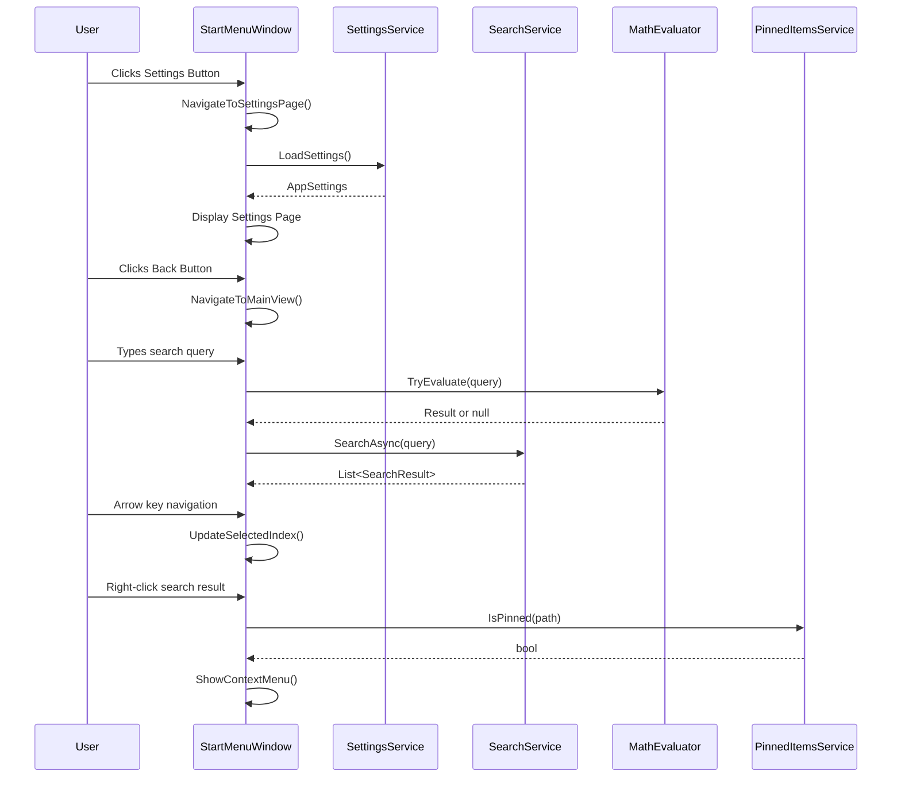

# Design Document: Start Menu Enhancements

## Overview

Bu tasarım belgesi, Custom Start Menu uygulamasına eklenecek 15 yeni özelliğin teknik mimarisini tanımlar. Mevcut WPF/C# altyapısı üzerine inşa edilecek ve MVVM benzeri bir yapı korunacaktır.

## Architecture

### High-Level Architecture

```
┌─────────────────────────────────────────────────────────────┐
│                    StartMenuWindow (UI)                      │
├─────────────────────────────────────────────────────────────┤
│  ┌─────────────────────────────────────────────────────────┐│
│  │                    Content Area                          ││
│  │  ┌─────────────┐  ┌─────────────┐  ┌─────────────────┐  ││
│  │  │ Main View   │  │ Search View │  │ Settings Page   │  ││
│  │  │ (Pinned)    │  │             │  │ (In-Window)     │  ││
│  │  └─────────────┘  └─────────────┘  └─────────────────┘  ││
│  └─────────────────────────────────────────────────────────┘│
├─────────────────────────────────────────────────────────────┤
│                      Services Layer                          │
│  ┌──────────────┐ ┌──────────────┐ ┌──────────────────────┐ │
│  │ Settings     │ │ Search       │ │ PinnedItems          │ │
│  │ Service      │ │ Service      │ │ Service              │ │
│  └──────────────┘ └──────────────┘ └──────────────────────┘ │
│  ┌──────────────┐ ┌──────────────┐ ┌──────────────────────┐ │
│  │ Math         │ │ App          │ │ Context Menu         │ │
│  │ Evaluator    │ │ Indexer      │ │ Service              │ │
│  └──────────────┘ └──────────────┘ └──────────────────────┘ │
├─────────────────────────────────────────────────────────────┤
│                      Models Layer                            │
│  ┌──────────────┐ ┌──────────────┐ ┌──────────────────────┐ │
│  │ AppSettings  │ │ SearchResult │ │ PinnedItem           │ │
│  └──────────────┘ └──────────────┘ └──────────────────────┘ │
└─────────────────────────────────────────────────────────────┘
```

### Component Interaction Flow



## Components and Interfaces

### 1. SettingsService

Yeni bir servis sınıfı - uygulama ayarlarını yönetir.

```csharp
public class SettingsService
{
    public AppSettings Settings { get; private set; }
    public event EventHandler? SettingsChanged;
    
    public void Load();
    public void Save();
    public void UpdateSetting<T>(string key, T value);
}
```

### 2. AppSettings Model

```csharp
public class AppSettings
{
    public bool ShowIconsOnly { get; set; } = false;
    public double MenuTransparency { get; set; } = 0.85;
    public LayoutMode PinnedItemsLayout { get; set; } = LayoutMode.Ordered;
    public string WebSearchUrl { get; set; } = "https://www.google.com/search?q=";
}

public enum LayoutMode
{
    Ordered,    // Sıralı - otomatik grid
    FreeForm    // Serbest - kullanıcı yerleştirir
}
```

### 3. Enhanced SearchService

Mevcut SearchService genişletilecek:

```csharp
public class SearchService
{
    // Existing methods...
    
    // New: Search installed apps from Registry
    private List<SearchResult> SearchRegistryApps(string query);
    
    // New: Search UWP/Store apps
    private List<SearchResult> SearchUwpApps(string query);
    
    // New: Search AppData folders
    private List<SearchResult> SearchAppDataApps(string query);
}
```

### 4. MathEvaluator

Yeni bir yardımcı sınıf - matematik ifadelerini değerlendirir.

```csharp
public static class MathEvaluator
{
    public static bool TryEvaluate(string expression, out double result);
    public static string FormatResult(double value);
}
```

### 5. Enhanced PinnedItem Model

```csharp
public class PinnedItem
{
    // Existing properties...
    
    // New: Custom display name (independent of file name)
    public string? CustomName { get; set; }
    
    // New: Position for free-form layout
    public int? GridRow { get; set; }
    public int? GridColumn { get; set; }
    
    // Computed property for display
    public string DisplayName => CustomName ?? Name;
}
```

### 6. Enhanced ContextMenuService

```csharp
public class ContextMenuService
{
    // Existing methods...
    
    // New: Register context-aware menu (Pin/Unpin based on state)
    public bool RegisterContextAwareMenu();
    
    // New: Handle unpin action
    public void HandleUnpin(string path);
}
```

## Data Models

### Settings Storage (settings.json)

```json
{
    "showIconsOnly": false,
    "menuTransparency": 0.85,
    "pinnedItemsLayout": "Ordered",
    "webSearchUrl": "https://www.google.com/search?q="
}
```

### Enhanced PinnedItem Storage

```json
{
    "items": [
        {
            "id": "guid",
            "name": "Spotify",
            "customName": "Müzik",
            "path": "C:\\...",
            "type": "Application",
            "tabId": "...",
            "groupId": "...",
            "order": 0,
            "gridRow": null,
            "gridColumn": null
        }
    ]
}
```

### Search Result Types

```csharp
public enum SearchResultType
{
    Application,
    Folder,
    File,
    Calculation,    // New: Math result
    WebSearch,      // New: Web search suggestion
    InternetShortcut // New: .url files
}
```


## Correctness Properties

*A property is a characteristic or behavior that should hold true across all valid executions of a system—essentially, a formal statement about what the system should do. Properties serve as the bridge between human-readable specifications and machine-verifiable correctness guarantees.*

### Property 1: Settings Round-Trip Persistence

*For any* valid AppSettings object, saving to storage and then loading should produce an equivalent settings object.

**Validates: Requirements 1.3, 1.4**

### Property 2: Icon-Only Mode Display Behavior

*For any* boolean value of the ShowIconsOnly setting, the pinned item display should correctly show/hide text labels and adjust button size accordingly (60x60 when true, 100x100 when false).

**Validates: Requirements 2.2, 2.3, 2.4**

### Property 3: Search Result Completeness

*For any* search query that matches an installed application, the search results should include that application regardless of its installation source (Registry, AppData, UWP, Start Menu).

**Validates: Requirements 3.4**

### Property 4: Search Caching Behavior

*For any* repeated search query within the cache expiry period, the second search should return results faster than the first (using cached index).

**Validates: Requirements 3.5**

### Property 5: Math Expression Evaluation

*For any* valid mathematical expression containing numbers, operators (+, -, *, /), parentheses, and decimals, the MathEvaluator should return the mathematically correct result.

**Validates: Requirements 6.1, 6.2, 6.3, 6.4**

### Property 6: Transparency Setting Application

*For any* transparency value between 0 and 1, setting the MenuTransparency should result in the menu background opacity matching that value, and the value should persist across sessions.

**Validates: Requirements 7.2, 7.3**

### Property 7: Unpin Action Removes Item

*For any* pinned item, calling RemovePin with its path should result in the item no longer appearing in the PinnedItems collection.

**Validates: Requirements 8.3**

### Property 8: URL File Pinning Support

*For any* valid .url (internet shortcut) file path, the AddPin method should successfully add it to the pinned items collection with type InternetShortcut.

**Validates: Requirements 10.1**

### Property 9: Context Menu Pin State Correctness

*For any* search result item, the context menu should show "Pinle" if the item is not pinned, and "Kaldır" if the item is already pinned.

**Validates: Requirements 11.2, 11.3**

### Property 10: Custom Name Storage Integrity

*For any* pinned item with a custom name set, the CustomName property should be stored separately from the Path, and the original file on disk should remain unchanged.

**Validates: Requirements 12.3, 12.4**

### Property 11: Drag-to-Group Moves Item

*For any* pinned item dragged and dropped onto a group folder, the item's GroupId should be updated to match the target group's Id.

**Validates: Requirements 13.2**

### Property 12: Group Order Persistence

*For any* group reorder operation, the new order values should be persisted and restored correctly on next load.

**Validates: Requirements 14.3**

### Property 13: Layout Mode Behavior

*For any* LayoutMode setting:
- When Ordered: items should have sequential Order values and null grid positions
- When FreeForm: items should have GridRow and GridColumn values preserved
- When switching from FreeForm to Ordered: grid positions should be cleared and items rearranged sequentially

**Validates: Requirements 15.2, 15.3, 15.4, 15.5**

## Error Handling

### Settings Errors
- IF settings file is corrupted, THEN load default settings and log warning
- IF settings file is inaccessible, THEN use in-memory defaults and retry save periodically

### Search Errors
- IF Registry access fails, THEN skip Registry source and continue with other sources
- IF UWP enumeration fails, THEN skip UWP source and log error
- IF math expression is invalid, THEN return null (not an error, just not a math query)

### Pinning Errors
- IF file path is invalid or inaccessible, THEN show user-friendly error message
- IF .url file is malformed, THEN treat as regular file

### Drag & Drop Errors
- IF drop target is invalid, THEN cancel operation and restore original state
- IF group no longer exists during drop, THEN move item to ungrouped

## Testing Strategy

### Unit Tests
Unit tests will verify specific examples and edge cases:
- Settings default values
- Math expression edge cases (division by zero, empty expression)
- Search result ordering
- Context menu item presence
- UI element visibility states

### Property-Based Tests
Property-based tests will use FsCheck (C# property-based testing library) to verify universal properties:
- Settings serialization round-trip
- Math evaluator correctness across random expressions
- Pin/unpin state consistency
- Layout mode transitions

### Test Configuration
- Minimum 100 iterations per property test
- Each property test tagged with: **Feature: start-menu-enhancements, Property {number}: {property_text}**
- Use FsCheck NuGet package for property-based testing
- Tests located in CustomStartMenu.Tests project

### Test Categories
1. **SettingsService Tests**: Properties 1, 6
2. **SearchService Tests**: Properties 3, 4, 5
3. **PinnedItemsService Tests**: Properties 7, 8, 10, 11, 12, 13
4. **UI Behavior Tests**: Properties 2, 9
